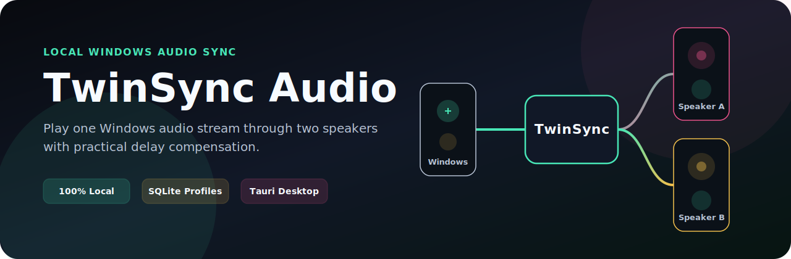
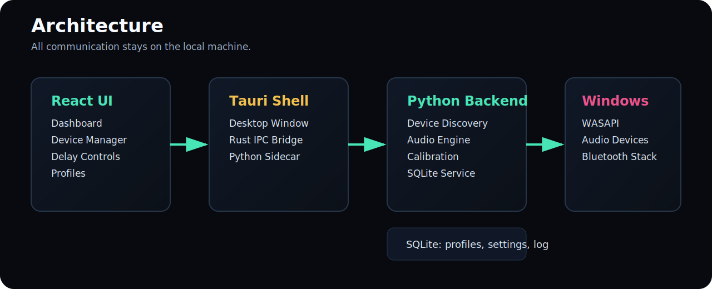
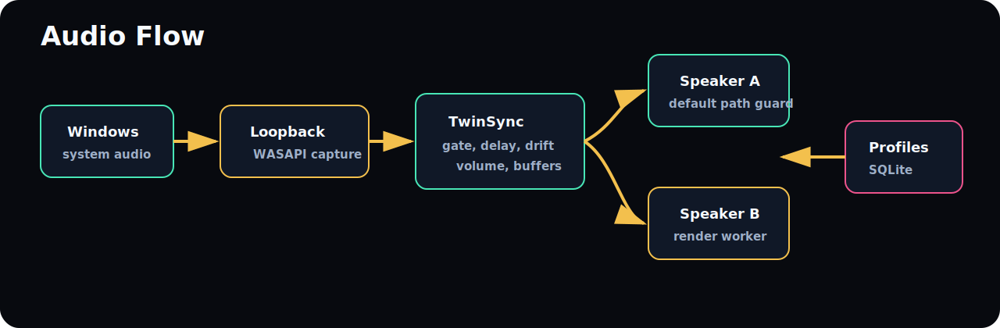
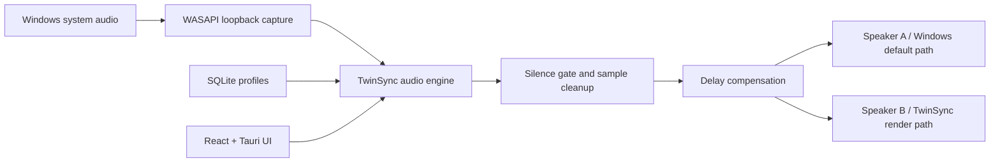
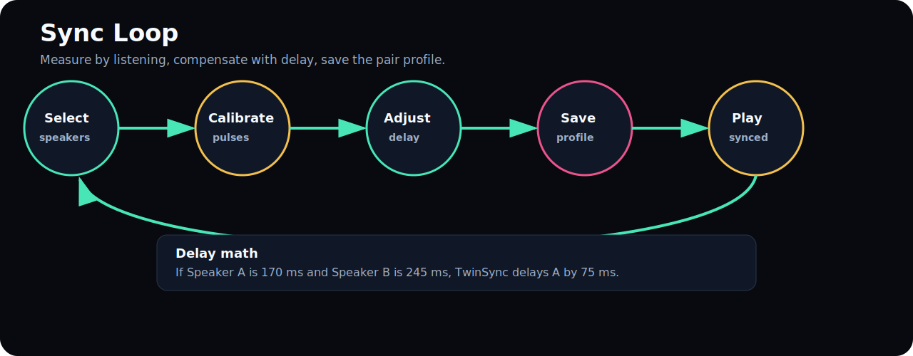
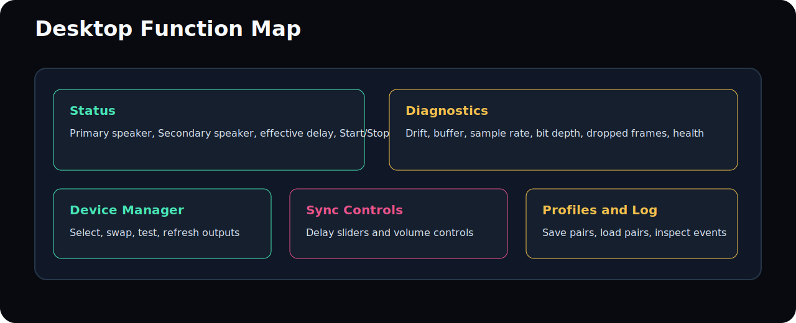

# TwinSync Audio

<p align="center">
  
</p>

**TwinSync Audio** is a local-first Windows desktop application for playing the same system audio through two independently selected speakers with practical latency compensation, guided calibration, profiles, diagnostics, and a modern Tauri + React interface.

It is built for the common problem Windows users hit with Bluetooth speakers: two speakers can be connected, but Windows does not provide a simple professional way to mirror system audio to both and tune delay between them.

TwinSync runs on the user's computer only.

- No cloud services
- No accounts
- No telemetry
- No ads
- No online audio processing
- Local Python backend
- Local SQLite database
- Local Tauri desktop shell

## Status

TwinSync is a production-shaped local app with real Windows audio device enumeration, local profiles, manual sync controls, guided calibration pulses, and a guarded dual-output audio engine.

Bluetooth and Windows audio APIs do not expose perfect acoustic latency, packet timing, signal strength, codec, or battery data for every speaker. TwinSync reports those fields only when available and uses guided calibration where true measurement would require a microphone or hardware loopback.

## What It Does

<p align="center">
  
</p>

TwinSync captures the Windows default audio output through WASAPI loopback, sends it through a local synchronization engine, and renders it to the second selected output device while leaving the default output to Windows when that avoids feedback.

### Core Capabilities

| Area | Functions |
| --- | --- |
| Device Manager | Detect Windows playback devices, list connection type, select Primary and Secondary speakers, refresh devices, test each speaker |
| Audio Capture | Capture current Windows system audio through local WASAPI loopback |
| Audio Routing | Route audio to selected speakers with format normalization and output guards |
| Sync Engine | Per-speaker delay compensation, delay math, drift estimate, buffer status |
| Calibration | Plays Primary, Secondary, then both-speaker pulses for guided alignment |
| Noise Control | Silence gate for low-level loopback static and invalid sample cleanup |
| Profiles | Save/load speaker pair, delay, volume, and audio mode in SQLite |
| Diagnostics | Playback state, drift, buffer size, sample rate, bit depth, dropped frames, health |
| UI | Dark glass desktop interface built with React and Tauri |
| Offline Runtime | Python backend launched locally by the Tauri shell over stdin/stdout IPC |

## Audio Flow

<p align="center">
  
</p>



## Synchronization Model

<p align="center">
  
</p>

TwinSync uses the following practical sync model:

1. User selects Primary and Secondary speakers.
2. TwinSync verifies both are separate playback endpoints.
3. Calibration plays pulse A, pulse B, then both together.
4. User adjusts delay sliders until the final pulse sounds centered.
5. TwinSync saves delay values to a local profile.
6. Playback uses the saved delay compensation and a silence gate during routing.

Why guided calibration? Windows can tell an app when samples are submitted to an audio endpoint, but it cannot reliably tell when a Bluetooth speaker physically emits the sound. Acoustic measurement needs a microphone or hardware loopback. TwinSync does not fake that number.

## Desktop UI

<p align="center">
  
</p>

The app includes:

- Large playback state indicator
- Primary and Secondary speaker selectors
- Test A and Test B buttons
- Swap speaker button
- Start/Stop routing
- Calibration button
- Manual per-speaker delay controls
- Master, Primary, and Secondary volume controls
- Profile save/load controls
- Event log
- Live diagnostics panel
- About Developer section

## Project Structure

```text
TwinSync/
  backend/
    twinsync_backend/
      audio_engine.py       # capture, routing, delay, noise gate, feedback guard
      calibration.py        # guided calibration result model
      database.py           # SQLite settings, profiles, event log
      device_manager.py     # Windows audio device discovery
      ipc_server.py         # JSON-lines backend IPC
      models.py             # typed domain models
      service.py            # app command layer
  frontend/
    src/                    # React UI
    src-tauri/              # Tauri desktop shell and Rust IPC bridge
  tests/                    # backend regression tests
  docs/                     # user and developer guides
  installer/                # Windows build script
  assets/github/            # README graphics
```

## Download And Installation

Download the latest Windows installer from GitHub Releases:

https://github.com/1SAMAY/TwinSync-Audio/releases

For normal use, download `TwinSyncAudio-Setup-v0.1.1.exe`, run the installer, and launch **TwinSync Audio** from the Start Menu.

The portable build is also available as `TwinSyncAudio-Portable-v0.1.1.zip`. Extract it and run `TwinSyncAudio.exe`.

## Release Package v0.1.1

GitHub release: `TwinSync Audio v0.1.1`

Download package files:

- `TwinSyncAudio-Setup-v0.1.1.exe` - recommended Windows installer for friends and testers.
- `TwinSyncAudio-Portable-v0.1.1.zip` - portable build; extract and run `TwinSyncAudio.exe`.
- `TwinSyncAudio-Source-v0.1.1.zip` - clean source archive without generated build files.
- `SHA256SUMS.txt` - checksums for verifying downloads.

Main functions in v0.1.1:

- Detect Windows playback devices.
- Select primary and secondary speakers.
- Route local Windows audio through the TwinSync backend.
- Adjust manual synchronization delay.
- Run guided calibration pulses.
- Save and load speaker profiles locally.
- View playback status, drift, buffer, and event diagnostics.
- Prevent unselected Windows default output devices from creating an uncontrolled third audible path.

Notes:

- Users do not need Python, Node.js, npm, Rust, or Visual Studio Build Tools.
- The installer can download Microsoft Edge WebView2 Runtime if it is missing.
- If Windows default output is not one of the selected TwinSync speakers, start is blocked with a clear warning. Set Windows default to the selected primary or secondary speaker before party playback.
- The executable is unsigned, so Windows SmartScreen may show an unknown publisher warning.
- Real sync quality depends on Bluetooth adapter, speaker model, Windows driver, codec, and speaker buffering.

## User Requirements

- Windows 10 or Windows 11, 64-bit
- Two Windows playback devices
- Bluetooth, USB, HDMI, or analog speaker hardware supported by Windows
- Microsoft Edge WebView2 Runtime, installed automatically by the setup wizard when needed

## Development Requirements

Install these on Windows:

- Python 3.11 or newer
- Node.js 20 or newer
- Rustup / Rust stable
- Visual Studio 2022 Build Tools with C++ workload

Install Rust:

```powershell
winget install --id Rustlang.Rustup -e
```

Install Visual Studio C++ Build Tools:

```powershell
winget install --id Microsoft.VisualStudio.2022.BuildTools -e --override "--wait --passive --add Microsoft.VisualStudio.Workload.VCTools --includeRecommended"
```

After installing Rust or Build Tools, close PowerShell and open a new one.

## Run In Development

```powershell
cd TwinSync-Audio

python -m venv .venv
.\.venv\Scripts\python.exe -m pip install -e .[windows]

cd frontend
npm.cmd install

$env:Path += ";$env:USERPROFILE\.cargo\bin"
$env:TWINSYNC_PYTHON = "..\.venv\Scripts\python.exe"
npm.cmd run tauri:dev
```

## How To Use

1. Connect both speakers in Windows first.
2. Open **Windows Settings > System > Sound > Output** and confirm both devices appear as playback outputs.
3. Start TwinSync.
4. Pick **Primary Speaker**.
5. Pick **Secondary Speaker**.
6. Press **Test A** and **Test B**.
7. Set your normal music speaker as the Windows default output.
8. Press **Start**.
9. Play music in Spotify, browser, game, media player, or any Windows app.
10. Press **Calibrate**.
11. Listen to the pulse sequence: Primary, Secondary, both.
12. Adjust the delay sliders until the final pulse sounds centered.
13. Save the profile.

## Calibration Guide

Use this simple listening method:

| What You Hear | What To Do |
| --- | --- |
| Primary speaker is early | Increase Primary Delay |
| Secondary speaker is early | Increase Secondary Delay |
| Final pulse sounds like one centered hit | Save the profile |
| Final pulse sounds like an echo | Keep adjusting delay |
| Static when no music is playing | Stop and restart after this fix; the silence gate should mute low-level loopback noise |

Delay range: `0` to `500 ms` per speaker.

## Why The Default Speaker Matters

For the cleanest routing:

1. Set one speaker as the Windows default output.
2. Select that same speaker as one TwinSync speaker.
3. Select the second speaker as the other TwinSync speaker.

TwinSync detects when a selected speaker is already the Windows capture/default endpoint and avoids playing back into that same endpoint again. This prevents loopback self-feed, which can sound like static or hiss.

## Diagnostics

TwinSync shows:

- Playback state
- Effective delay
- Drift estimate
- Buffer size
- Sample rate
- Bit depth
- Dropped frames
- Connection health
- Event log

Fields such as Bluetooth codec, signal strength, and battery are shown only when Windows exposes them through local APIs.

## Run Tests

```powershell
cd TwinSync-Audio
$env:PYTHONPATH = "backend"
.\.venv\Scripts\python.exe -m unittest discover -s tests
```

## Build Windows Installer

```powershell
cd TwinSync-Audio
.\installer\build_windows.ps1
```

The script builds the Python backend sidecar with PyInstaller, runs the Tauri Windows bundle build, creates the portable zip, creates the source zip, and writes checksums plus release reports under `release\v0.1.1`.

## Local IPC

The Tauri shell starts the Python backend locally and communicates through JSON lines:

```json
{"id":1,"method":"status","params":{}}
```

Response:

```json
{"id":1,"ok":true,"result":{"metrics":{"playback_state":"stopped"}}}
```

No HTTP backend server is required for the audio engine.

## Current Limitations

- Automatic acoustic latency measurement requires a real measurement input.
- Bluetooth codec, RF signal strength, and speaker battery are not consistently exposed by Windows audio APIs.
- The first Tauri build can take a while because Rust crates compile locally.
- Two-speaker Bluetooth sync is limited by Windows scheduling, Bluetooth stack latency, and speaker hardware buffering.

TwinSync handles these limits by exposing manual delay, guided calibration, local profiles, silence gating, and honest diagnostics.

## Verification Snapshot

Recent local checks:

```text
Backend tests: 11 passed
Frontend build: passed
PyInstaller backend build: passed
```

## Documentation

- [User Guide](docs/USER_GUIDE.md)
- [Developer Guide](docs/DEVELOPER_GUIDE.md)
- [Development](docs/DEVELOPMENT.md)
- [Windows Build](docs/BUILD_WINDOWS.md)
- [Release Process](docs/RELEASE_PROCESS.md)
- [Privacy](PRIVACY.md)
- [Support](SUPPORT.md)
- [Security](SECURITY.md)
- [Windows build script](installer/build_windows.ps1)

## Repository Notes

Generated caches and local runtime files are intentionally ignored:

- `.venv/`
- `node_modules/`
- `frontend/src-tauri/target/`
- `frontend/src-tauri/gen/`
- `backend/*.egg-info/`
- local SQLite databases
- logs
- installer output

## License

The creator is still cooking. Until an official open-source license drops, this repo is under lock and key. No lifting, shifting, or drifting the code until the green light is explicitly given.
